# polyviz

**D3-quality interactive visualisation and polyglot data analysis, with a pure R interface.**

polyviz was born from loving [d3.js](https://d3js.org) visualisations but not wanting to write JavaScript. Every chart is rendered by a bundled copy of D3 v7 — real d3 scales, transitions, tooltips, force simulations — but you drive it entirely from R data frames.

**→ [Live demo gallery](https://jastephan63.github.io/polyviz/)** — every chart type, interactive, on real Swiss open government data.

Behind the R interface, the package deliberately spans four backend languages:

| Language | Where it lives | What it does |
|---|---|---|
| **JavaScript (D3 v7)** | `inst/htmlwidgets/` | Renders all sixteen interactive chart types |
| **SQL** | `R/sql.R`, `inst/sql/` | SQLite querying, parameterised queries, runnable `.sql` script files |
| **Python** | `inst/python/polyviz.py` | Numeric profiling and outlier detection (stdlib only — no pandas needed), with an identical pure-R fallback |
| **SAS** | `R/sas.R` | Reads/writes `sas7bdat` and `xpt` datasets with variable labels, no SAS licence required |

## Installation

```r
# install.packages("devtools")
devtools::install_github("jastephan63/polyviz")
```

Python is optional. If `reticulate` finds any Python ≥ 3.8, the profiling functions use it; otherwise they transparently run the same computation in R.

## Design

The look is research-backed, not taste-backed. The typeface is [Inter](https://rsms.me/inter/) (bundled, SIL OFL) — the open-licence counterpart of the grotesques used by the FT, The Economist, and the NYT graphics desks — with true tabular numerals on every axis. The categorical palette is anchored on The Economist's published web palette, then re-stepped in OKLCH colour space and slot-ordered by exhaustive search so that adjacent series remain distinguishable under the common colour-vision deficiencies, in light **and** dark mode (every chart follows your system theme automatically). Chart anatomy follows newsroom craft: left-aligned title block, horizontal hairline gridlines only, a zero baseline, direct labels over legends, compact "12.8k" numbers on axes with exact values in tooltips, and a source line on every chart.

## The charts

All charts are interactive htmlwidgets: they animate in, respond to hover with tooltips, follow light/dark mode, and work in the RStudio Viewer, R Markdown, Quarto, and Shiny (`pvchartOutput()` / `renderPvchart()`). Each example below runs as-is on data bundled with the package.

<!-- gallery:start -->

### Bar chart

The bar chart is the workhorse of comparison - one bar per category, length encoding the value. polyviz draws bars with rounded value-ends growing from a zero baseline. Orientation defaults to "auto": a single-series chart flips itself horizontal when its category labels are too long to sit under vertical bars, and vertical bars print their values on top when there is room for the numbers. Here the horizontal orientation is pinned explicitly - the readable choice for ranked categories, labels upright and the exact value at each bar's end - ranking how the city of Lucerne uses its land: agriculture and buildings each cover more ground than forest, and unproductive land is nearly absent.

<picture><source media="(prefers-color-scheme: dark)" srcset="man/figures/bar-dark.png">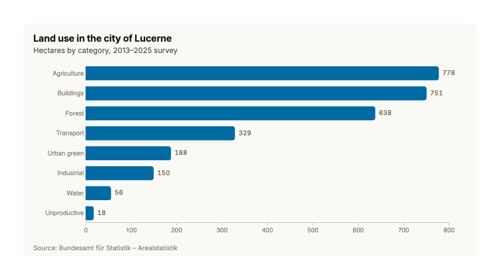</picture>

```r
pv_bar(
  aggregate(hectares ~ category,
            pv_city_landuse[pv_city_landuse$city == "Luzern", ], sum),
  x = "category", y = "hectares", sort = TRUE, horizontal = TRUE,
  title = "Land use in the city of Lucerne",
  subtitle = "Hectares by category, 2013–2025 survey",
  source = "Source: Bundesamt für Statistik – Arealstatistik"
)

```

### Line chart

The line chart shows how values evolve - polyviz draws each series in with a left-to-right animation, labels lines directly at their right ends (no legend hunting), and a crosshair tooltip reads out every series at the hovered year. The data here is nearly a century of population counts: the city of Lucerne grew until about 1970 and then plateaued, while its suburbs kept climbing.

<picture><source media="(prefers-color-scheme: dark)" srcset="man/figures/line-dark.png">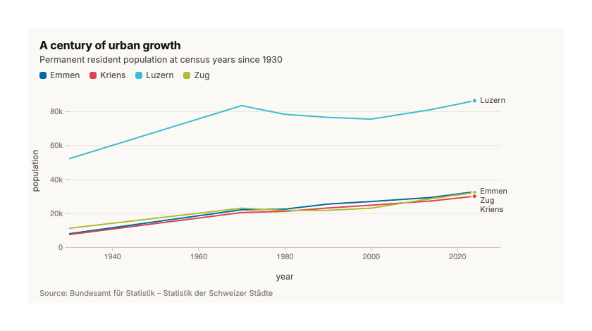</picture>

```r
pv_line(
  pv_city_population[pv_city_population$city %in%
                       c("Luzern", "Emmen", "Kriens", "Zug"), ],
  x = "year", y = "population", series = "city",
  title = "A century of urban growth",
  subtitle = "Permanent resident population at census years since 1930",
  source = "Source: Bundesamt für Statistik – Statistik der Schweizer Städte"
)

```

### Scatter plot

The scatter plot reveals the relationship between two numeric variables, one dot per observation, with hover tooltips for exact values. This one shows how Lucerne's fiscal equalization works as designed: municipalities with a low resource index (weak tax base) receive large equalization payments, and everyone above the 100-index line receives nothing.

<picture><source media="(prefers-color-scheme: dark)" srcset="man/figures/scatter-dark.png">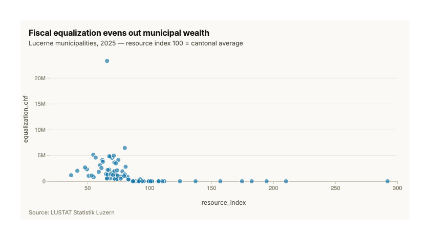</picture>

```r
pv_scatter(
  pv_fiscal[pv_fiscal$year == 2025, ],
  x = "resource_index", y = "equalization_chf", label = "municipality",
  title = "Fiscal equalization evens out municipal wealth",
  subtitle = "Lucerne municipalities, 2025 — resource index 100 = cantonal average",
  source = "Source: LUSTAT Statistik Luzern"
)

```

### Force-directed network

The force-directed network is d3's signature physics simulation: nodes repel, links pull, and you can grab any node and drag it. Nodes here are large Swiss cities, linked when their economic structures are highly similar (correlation of employment shares across all 19 economic sectors above 0.94), sized by how many similar cities each has, and coloured by population class. Hovering a city highlights its economic look-alikes. Labels wear a halo of the background and drop below their node when two would collide, and a gentle pull toward the centre keeps separate components in frame.

<picture><source media="(prefers-color-scheme: dark)" srcset="man/figures/force-dark.png">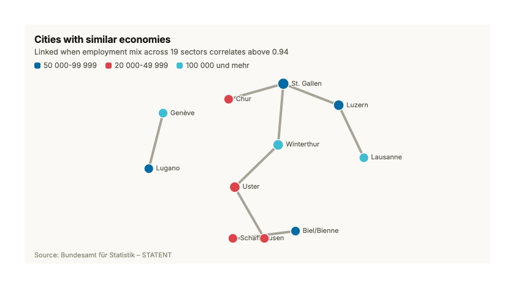</picture>

```r
local({
  # Wide matrix of sector shares per city, for the 30 most populous cities.
  # xtabs keeps sectors aligned even where a city has no row for a sector.
  latest <- pv_city_population[pv_city_population$year ==
                                 max(pv_city_population$year), ]
  top <- head(latest$city[order(-latest$population)], 30)
  sect <- pv_city_sectors[pv_city_sectors$city %in% top, ]
  wide <- stats::xtabs(share ~ city + sector_code, data = sect)
  sim <- stats::cor(t(wide))
  pairs <- which(sim > 0.94 & upper.tri(sim), arr.ind = TRUE)
  cities <- rownames(sim)
  links <- data.frame(source = cities[pairs[, 1]],
                      target = cities[pairs[, 2]])
  nodes <- data.frame(
    id = cities,
    class = latest$size_class[match(cities, latest$city)]
  )
  keep <- nodes$id %in% c(links$source, links$target)
  pv_force(nodes[keep, ], links, group = "class",
           title = "Cities with similar economies",
           subtitle = "Linked when employment mix across 19 sectors correlates above 0.94",
           source = "Source: Bundesamt für Statistik – STATENT")
})

```

### Chord diagram

The chord diagram shows flows between entities around a circle - ribbon width encodes volume, and hovering a group fades everything unrelated. Here it shows commuting between Canton Zug and its neighbours: ribbons leaving the Zug arc are people commuting out, ribbons arriving are people commuting in, and the asymmetry is the story - Zug pulls in far more workers than it sends out.

<picture><source media="(prefers-color-scheme: dark)" srcset="man/figures/chord-dark.png">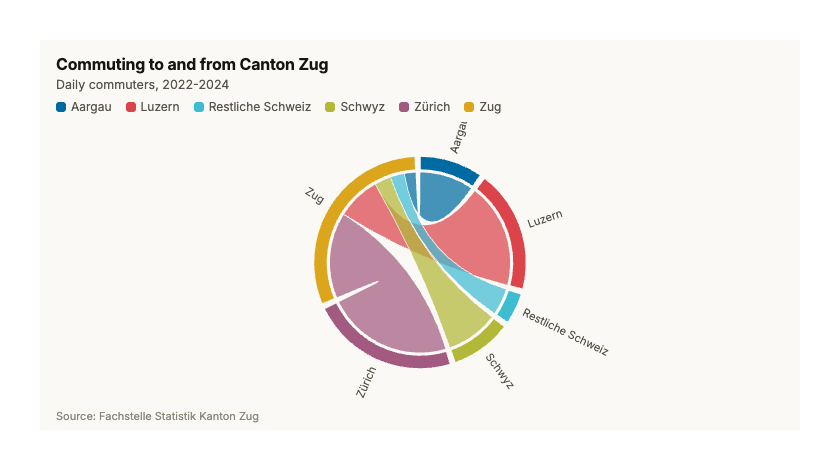</picture>

```r
local({
  latest <- pv_commuters[pv_commuters$period ==
                           max(pv_commuters$period), ]
  regions <- unique(latest$region)
  m <- matrix(0, length(regions) + 1, length(regions) + 1,
              dimnames = list(c(regions, "Zug"), c(regions, "Zug")))
  to_zug <- latest[latest$direction == "to Zug", ]
  from_zug <- latest[latest$direction == "from Zug", ]
  m[to_zug$region, "Zug"] <- to_zug$commuters
  m["Zug", from_zug$region] <- from_zug$commuters
  pv_chord(m,
           title = "Commuting to and from Canton Zug",
           subtitle = paste("Daily commuters,", max(latest$period)),
           source = "Source: Fachstelle Statistik Kanton Zug")
})

```

### Zoomable sunburst

The sunburst lays a hierarchy out as concentric rings - the inner ring is the top level, outer rings its parts, and clicking any segment zooms into that branch (the centre zooms back out). The hierarchy here is Lucerne's land use in two levels: settlement, cultivated, and natural land, each split into its categories, so you can see at a glance that cultivated land dominates and then zoom into how the settlement area subdivides. Segments too thin to carry their label stay unlabelled - hovering names any of them.

<picture><source media="(prefers-color-scheme: dark)" srcset="man/figures/sunburst-dark.png">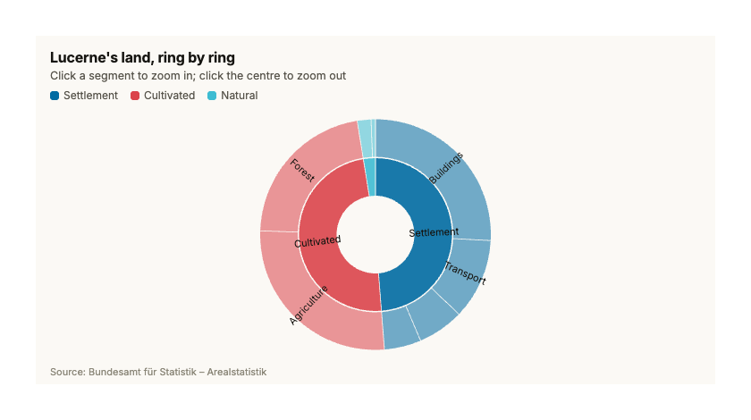</picture>

```r
pv_sunburst(
  pv_city_landuse[pv_city_landuse$city == "Luzern", ],
  levels = c("group", "category"), value = "hectares",
  title = "Lucerne's land, ring by ring",
  subtitle = "Click a segment to zoom in; click the centre to zoom out",
  source = "Source: Bundesamt für Statistik – Arealstatistik"
)
```

### Donut chart

The donut shows how one whole divides into parts - each slice's angle is its share, the hole in the middle carries the grand total, and slices sweep in largest-first. Big slices are labelled directly with their share; slivers move to a legend, and hovering any slice pops it outward with its exact value and percentage. On charts narrower than about 480px the outside labels would collide, so all slices move to the legend automatically (the labels flag can force either look). Here it splits the 385 municipal council seats filled in Lucerne's 2024 elections: Mitte took nearly half of them, the FDP about a quarter, and no other party reached ten percent.

<picture><source media="(prefers-color-scheme: dark)" srcset="man/figures/donut-dark.png">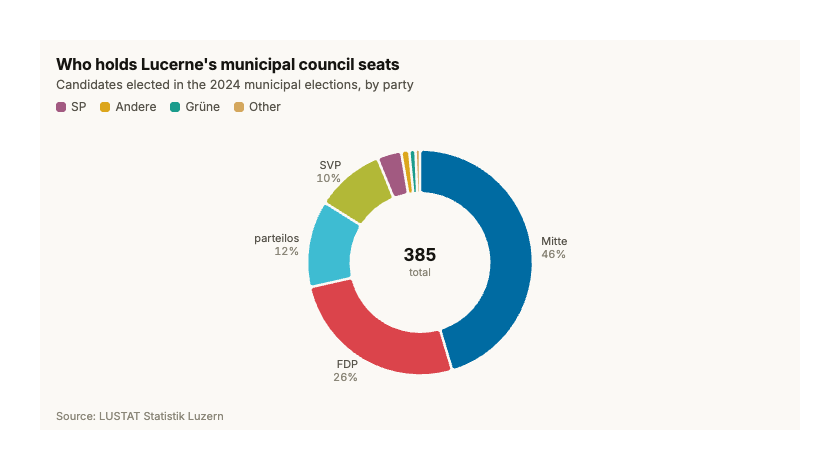</picture>

```r
{
  # pv_donut caps a chart at 8 slices - more than that is unreadable - so
  # everything after the 7 largest parties is folded into an "Other" bin
  # (pv_donut sums slices that share a label).
  seats <- aggregate(elected ~ party,
                     pv_elections[pv_elections$year == 2024, ], sum)
  seats <- seats[order(-seats$elected), ]
  seats$party[-(1:7)] <- "Other"
  pv_donut(
    seats, category = "party", value = "elected",
    title = "Who holds Lucerne's municipal council seats",
    subtitle = "Candidates elected in the 2024 municipal elections, by party",
    source = "Source: LUSTAT Statistik Luzern"
  )
}

```

### Treemap

The treemap packs a hierarchy into nested rectangles - each cell's area is its value, its colour names its top-level branch, and labels appear only where they honestly fit (the labels flag can make them eager, or turn them off entirely). Hovering a cell keeps its branch lit, dims the rest, and reads out the full path and share of the total. This one carves up the city of Lucerne's roughly 2,900 hectares: settlement and cultivated land split it almost exactly in half (buildings and agriculture are the two biggest single categories), while natural land - water and unproductive ground - is a thin sliver of under three percent.

<picture><source media="(prefers-color-scheme: dark)" srcset="man/figures/treemap-dark.png">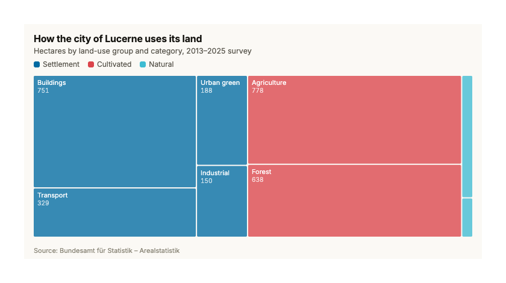</picture>

```r
pv_treemap(
  pv_city_landuse[pv_city_landuse$city == "Luzern", ],
  levels = c("group", "category"), value = "hectares",
  title = "How the city of Lucerne uses its land",
  subtitle = "Hectares by land-use group and category, 2013–2025 survey",
  source = "Source: Bundesamt für Statistik – Arealstatistik"
)

```

### Lollipop chart

The lollipop is a ranking chart - the bar chart's lighter cousin, marking each value with a hairline stem and a dot so dozens of categories stay readable without heavy ink. Categories run down the left, stems grow out from zero on load, the value sits at each head, and hovering a row highlights it with the exact figure. The name column never takes more than 45% of the width - on narrow charts long names are shortened with an ellipsis (hover for the full name) and the head values step aside when the plot drops under 200px (the value_labels flag can force either look). Ranked here: Lucerne's 2025 fiscal equalization, where Emmen receives about 23 million francs - more than three times second-placed Kriens - and the amounts flatten out quickly further down the field.

<picture><source media="(prefers-color-scheme: dark)" srcset="man/figures/lollipop-dark.png">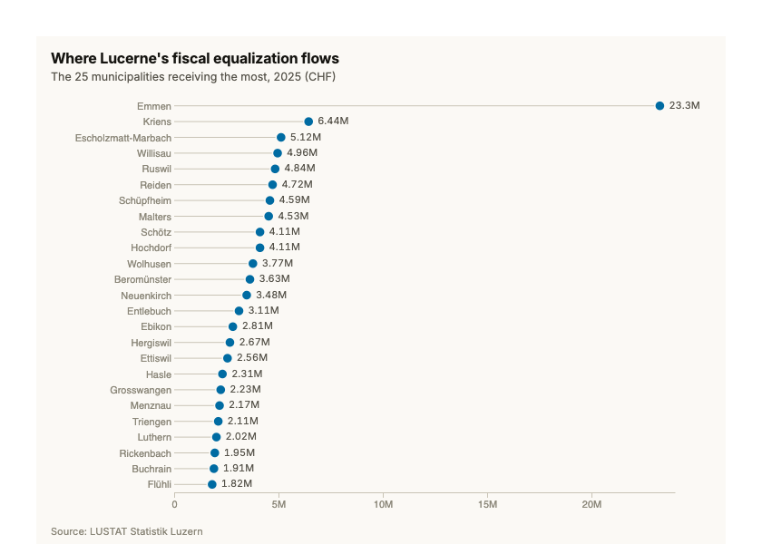</picture>

```r
{
  f25 <- pv_fiscal[pv_fiscal$year == 2025, ]
  top <- head(f25[order(-f25$equalization_chf), ], 25)
  pv_lollipop(
    top, x = "municipality", y = "equalization_chf",
    title = "Where Lucerne's fiscal equalization flows",
    subtitle = "The 25 municipalities receiving the most, 2025 (CHF)",
    source = "Source: LUSTAT Statistik Luzern",
    height = 560
  )
}
```

### Histogram

A histogram counts values into equal-width bins to show the shape of one numeric variable — where values pile up, how far they spread, and whether the distribution is skewed. Hover any bar for its exact bin range and count; the overlaid curve is a kernel density estimate rescaled to count space, so it traces the same shape the bars show. Here it's the tax resource potential per resident of the 79 Lucerne municipalities in 2025: most cluster between roughly 2,000 and 3,500 CHF, with a long right tail of wealthy lakeside communities running out to Meggen at about 10,600 CHF.

<picture><source media="(prefers-color-scheme: dark)" srcset="man/figures/histogram-dark.png">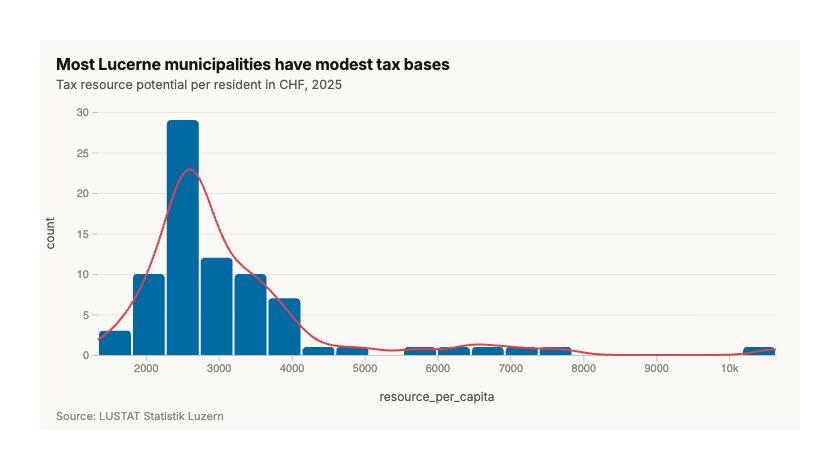</picture>

```r
pv_histogram(subset(pv_fiscal, year == 2025), x = "resource_per_capita",
             bins = 20, density = TRUE,
             title = "Most Lucerne municipalities have modest tax bases",
             subtitle = "Tax resource potential per resident in CHF, 2025",
             source = "Source: LUSTAT Statistik Luzern")

```

### Boxplot

A boxplot compresses a whole distribution into five numbers — quartile box, median line, whiskers to the last values within 1.5 IQR, dots for outliers beyond — which makes it the right tool for comparing several distributions side by side. Hovering a box dims the others and reads out all five statistics plus the group size; the jittered points behind each box show the underlying values. By default (points = "auto") the point cloud appears only when the groups hold at most 600 values in total; here points = TRUE forces it on for all 638. On narrow screens crowded group labels thin themselves out or shorten with an ellipsis — the full name is always in the tooltip. Across 2020-2027 the median Lucerne municipality's tax resources creep up from about 2,600 to 2,800 CHF per resident, while the same handful of wealthy outliers (Meggen, Weggis, Vitznau) float far above the boxes every single year.

<picture><source media="(prefers-color-scheme: dark)" srcset="man/figures/boxplot-dark.png">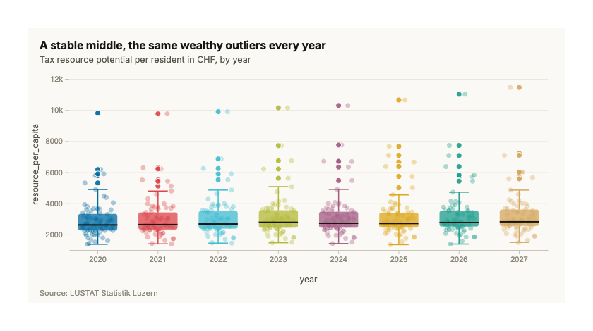</picture>

```r
pv_boxplot(pv_fiscal, value = "resource_per_capita", group = "year",
           points = TRUE,
           title = "A stable middle, the same wealthy outliers every year",
           subtitle = "Tax resource potential per resident in CHF, by year",
           source = "Source: LUSTAT Statistik Luzern")

```

### Ridgeline

A ridgeline chart stacks one density curve per group on overlapping baselines, so your eye can track how the shape of a distribution shifts across groups — typically across time. Ridges are ordered by median from the top down, and hovering one lifts it to full opacity while dimming the rest, with the group's median and size in the tooltip. Group labels claim at most 30% of the chart width — on narrow screens long names shorten with an ellipsis and stay complete in the tooltip. The resource index sets the cantonal average to 100, and the bulk of Lucerne's municipalities slides steadily leftward: the median falls from 78 in 2020 to 70 by 2027, meaning the typical municipality drifts further below an average that a few rich outliers pull up.

<picture><source media="(prefers-color-scheme: dark)" srcset="man/figures/ridgeline-dark.png">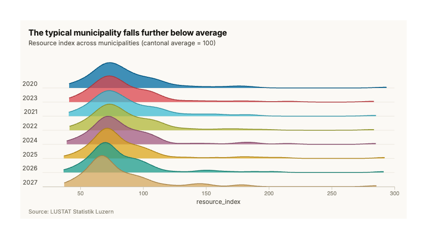</picture>

```r
pv_ridgeline(pv_fiscal, value = "resource_index", group = "year",
             title = "The typical municipality falls further below average",
             subtitle = "Resource index across municipalities (cantonal average = 100)",
             source = "Source: LUSTAT Statistik Luzern")
```

### Stacked area

A stacked area chart piles series on top of each other, so you read the total from the outer edge and each part's contribution from its band — the form to reach for when the question is "how did the whole grow, and who did the growing". Hover anywhere for a crosshair that reads out every series (and the total) at that year, and hover a band to lift it out of the stack; offset = "percent" or "stream" re-renders the same data as composition-over-time or a streamgraph. The legend appears whenever there is more than one series (force it either way with legend = TRUE/FALSE), and xlab/ylab override the column-name axis titles — NA or "" gives their room back to the plot, which helps on phone-width charts. Here the five biggest municipalities of the Lucerne agglomeration grew from about 72,000 people in 1930 to almost 180,000 in 2024 — but the city of Luzern itself peaked around 1970, so the suburbs did nearly all the growing since: Emmen and Kriens quadrupled, and Ebikon grew more than sixfold.

<picture><source media="(prefers-color-scheme: dark)" srcset="man/figures/area-dark.png">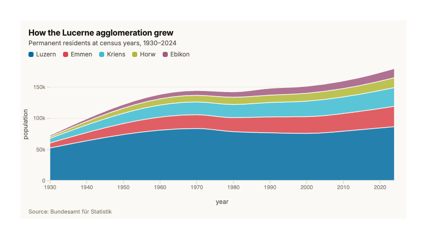</picture>

```r
{
  cities <- c("Luzern", "Emmen", "Kriens", "Horw", "Ebikon")
  agglo <- subset(pv_city_population, city %in% cities)
  agglo <- agglo[order(match(agglo$city, cities)), ]
  pv_area(agglo, x = "year", y = "population", series = "city",
          title = "How the Lucerne agglomeration grew",
          subtitle = "Permanent residents at census years, 1930–2024",
          source = "Source: Bundesamt für Statistik")
}

```

### Heatmap

A heatmap crosses two categories and colours each cell by a value, which makes a 200-cell table readable at a glance — use it when the pattern across the whole grid matters more than any single number. Darker cells mean a bigger share; hover any cell for the exact value and the full sector name, and the gradient bar under the title is the colour scale. Cells print their value only when there is room (cell_values = TRUE forces it, shrinking the font for tight cells), and row labels shorten past truncate_labels characters — further still on narrow screens, where the label margin never takes more than 40% of the width, so the cells stay readable on a phone. Across the twelve most populous Swiss cities, health and social work is the biggest employer almost everywhere (24% of jobs in Lausanne), but each city keeps a signature: Bern and Bellinzona light up in public administration, Zürich, Genève and Lugano in finance, and Biel/Bienne is the lone manufacturing stronghold at over 20%.

<picture><source media="(prefers-color-scheme: dark)" srcset="man/figures/heatmap-dark.png">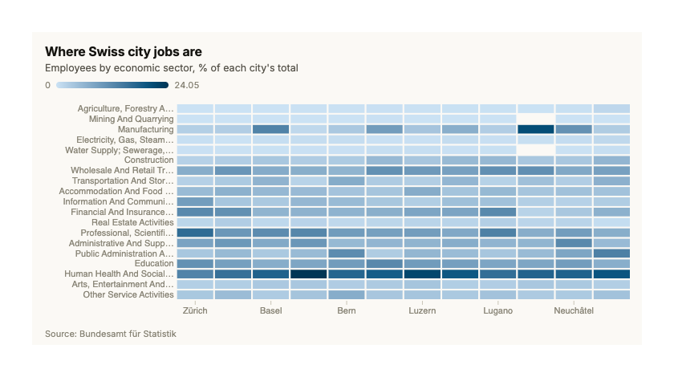</picture>

```r
{
  pop24 <- subset(pv_city_population, year == 2024)
  top12 <- head(pop24[order(-pop24$population), "city"], 12)
  emp <- subset(pv_city_sectors, city %in% top12)
  emp <- emp[order(match(emp$city, top12)), ]
  pv_heatmap(emp, x = "city", y = "sector", value = "share",
             title = "Where Swiss city jobs are",
             subtitle = "Employees by economic sector, % of each city's total",
             source = "Source: Bundesamt für Statistik")
}
```

### Sankey diagram

The sankey diagram traces flows between stages - node height is the total volume passing through, ribbon width the size of each individual flow. Hovering a ribbon reads out its exact count, and hovering a node fades every flow that doesn't touch it. Commuting in and out of Canton Zug shows a one-sided bargain: in 2022-2024 about 43,000 people streamed in each day (Zurich and Lucerne sending the biggest contingents) while only 20,000 left - and half of those headed for Zurich.

<picture><source media="(prefers-color-scheme: dark)" srcset="man/figures/sankey-dark.png">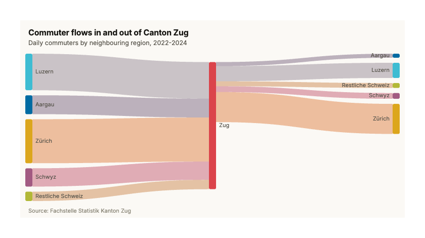</picture>

```r
local({
  latest <- pv_commuters[pv_commuters$period == max(pv_commuters$period), ]
  # Inbound rows flow region -> Zug, outbound rows Zug -> region. The
  # trailing space keeps each outbound destination distinct from its
  # inbound namesake, so every region shows up on both sides of Zug.
  links <- data.frame(
    source = ifelse(latest$direction == "to Zug", latest$region, "Zug"),
    target = ifelse(latest$direction == "to Zug", "Zug",
                    paste0(latest$region, " ")),
    value = latest$commuters
  )
  pv_sankey(links,
            title = "Commuter flows in and out of Canton Zug",
            subtitle = paste("Daily commuters by neighbouring region,",
                             max(latest$period)),
            note = "Source: Fachstelle Statistik Kanton Zug")
})

```

### Parallel coordinates

Parallel coordinates draw each row as one line threading across several vertical axes, one per variable - the line's shape is the row's profile, and bundles of similar shapes are the clusters. Drag along any axis to keep only a value range (brushes on several axes combine), double-click an axis to clear it, and hover a line to read the full row. Each line here is one of 181 Swiss cities profiled by what covers its ground: brush the top of the Buildings axis and the surviving lines dive on Agriculture - the dense Geneva suburbs around 70% built-up - while rural towns like Appenzell run the opposite diagonal.

<picture><source media="(prefers-color-scheme: dark)" srcset="man/figures/parallel-dark.png">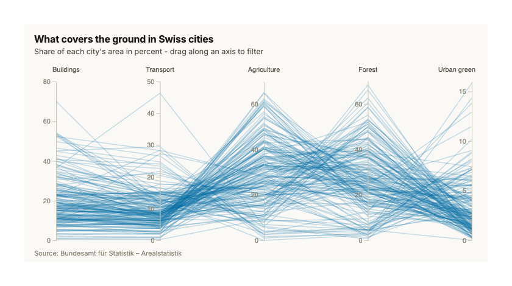</picture>

```r
local({
  lu <- pv_city_landuse
  lu$share <- 100 * lu$hectares / ave(lu$hectares, lu$city, FUN = sum)
  keep <- c("Buildings", "Transport", "Agriculture", "Forest", "Urban green")
  wide <- reshape(lu[lu$category %in% keep, c("city", "category", "share")],
                  direction = "wide", idvar = "city", timevar = "category")
  names(wide) <- sub("^share\\.", "", names(wide))
  pv_parallel(wide, columns = keep, label = "city",
              title = "What covers the ground in Swiss cities",
              subtitle = "Share of each city's area in percent - drag along an axis to filter",
              source = "Source: Bundesamt für Statistik – Arealstatistik")
})
```

<!-- gallery:end -->

## Getting data in

```r
# One reader for everything — dispatches on the file extension
pv_read("results.csv")
pv_read("trial.sas7bdat")
pv_read("warehouse.sqlite", table = "sales")

# SQL: connect, write, query (with ? parameter binding), run script files
con <- pv_db_connect("warehouse.sqlite")
pv_db_write(con, "sales", pv_sales)
pv_query(con, "SELECT region, SUM(revenue) AS revenue
               FROM sales GROUP BY region")
pv_query(con, "SELECT * FROM sales WHERE region = ?", params = list("North"))
pv_run_sql_file(con, system.file("sql", "demo.sql", package = "polyviz"))
pv_db_disconnect(con)

# SAS: round-trip datasets with variable labels intact
df <- pv_set_labels(pv_sales, c(revenue = "Net revenue, EUR"))
pv_write_sas(df, "sales.xpt")
pv_labels(pv_read_sas("sales.xpt"))
```

## Analysing it

```r
# One-look data-quality summary (dimensions, missingness, value sketches)
pv_summary(airquality)

# Numeric profiling — runs in Python when available, R otherwise
pv_profile(airquality)
attr(pv_profile(airquality), "engine")   # which backend did the work

# Outlier flags by IQR fence or z-score
pv_outliers(airquality$Ozone, method = "iqr")
```

## Bundled data

Six real open-government datasets ship with the package, covering the
population, economy, and territory themes of Swiss official statistics:

- `pv_city_population` — 181 Swiss cities at census years 1930–2024 (BFS)
- `pv_city_sectors` — employment shares by economic sector per city (BFS/STATENT)
- `pv_city_landuse` — land use in hectares, two hierarchy levels (BFS Arealstatistik)
- `pv_commuters` — commuter flows between Canton Zug and its neighbours (Fachstelle Statistik Zug)
- `pv_fiscal` — fiscal equalization of Lucerne municipalities (LUSTAT Statistik Luzern)
- `pv_elections` — Lucerne municipal council candidacies and seats (LUSTAT Statistik Luzern)

All are openly licensed with source citation required (see each dataset's
help page for the exact attribution); the LUSTAT datasets additionally
require the data owner's permission for commercial use. Three simulated
datasets (`pv_sales`, `pv_network`, `pv_flows`) remain for examples that
need shapes the real data doesn't provide.

## Licence

MIT © Jake Stephan. Bundled: [d3.js](https://d3js.org) (ISC),
[d3-sankey](https://github.com/d3/d3-sankey) (BSD-3),
[Inter](https://rsms.me/inter/) (SIL OFL 1.1).
